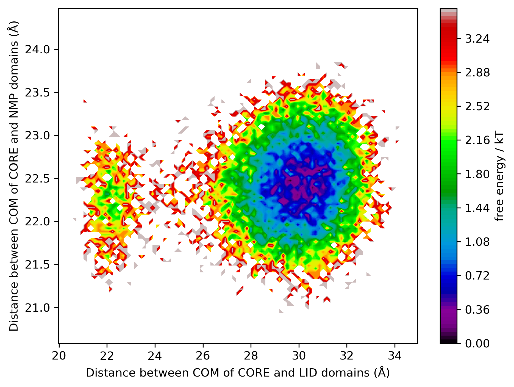

# Adenylate Kinase: Dual-Basin Coarse-Grained Model of a Conformational Transition

A two-person course project using instructor-provided SMOG-ready structures. My partner and I built a structure-based (Gō-like), Cα-resolution model of Adenylate Kinase (AKE) to study the conformational differences between the open (4AKE) and closed (1AKE) end states and to provide a dual-basin model for exploring the associated NMP/LID/CORE domain motion.

## Approach

- **Contact map construction** — native contacts extracted separately from the
  open (4AKE) and closed (1AKE) crystal structures.
- **Dual-basin ("microscopic mixing") potential** — native contacts from both
  end-states are combined into a single structure-based Hamiltonian, providing
  interactions associated with both reference conformations.
- **Coarse-grained simulation** — Cα-only Langevin dynamics run in OpenMM,
  parametrized from the mixed contact map. The stored trajectory is a 100 ns
  simulation initiated from the 4AKE (open) structure at the model temperature
  of 80 K. This is a coarse-grained simulation parameter, not a physiological temperature.
- **Analysis** — trajectory RMSD/Q analysis and domain-based collective
  coordinates (center-of-mass distances between the NMP, LID, and CORE domains);
  a PyEMMA free-energy representation is constructed along the selected
  collective coordinates.

## Repository structure

```text
notebooks/
  01_contact_map_creation.ipynb   – builds native-contact maps for 1AKE and 4AKE
  02_build_and_simulate.ipynb     – merges contact maps, builds the CG system, runs the simulation
  03_analysis.ipynb               – RMSD/Q analysis and free-energy landscape
data/
  structures/                     – input and processed PDB structures
  contact_maps/                   – native contact maps (per end-state and merged)
  system/                         – OpenMM system definition
trajectories/                     – simulation output (full system and per-domain)
results/
  free_energy_landscape.png   – free-energy landscape from the stored trajectory
  distances/                      – inter-residue distance calculations
```

## Reproducing

The notebooks are intended to be run in order using **Python 3.8.18** (see `.python-version`). Install the packages listed in `requirements.txt` in a compatible environment (`python -m pip install -r requirements.txt`). The project depends on OpenMM, MDTraj and PyEMMA; PyEMMA is an older dependency and may not install cleanly on newer Python versions.

1. `01_contact_map_creation.ipynb` — build the native-contact maps for the open and closed structures.
2. `02_build_and_simulate.ipynb` — construct the dual-basin coarse-grained system and run the Langevin simulation.
3. `03_analysis.ipynb` — analyse RMSD/Q and domain-distance coordinates and generate the free-energy landscape.

The stored trajectory and intermediate files allow the analysis stage to be inspected without rerunning the full simulation.

### Conformational landscape



The stored trajectory explores repeated **LID closure**, rather than a complete open-to-closed transition. LID–CORE stays near 30 Å (4AKE reference: 30.7 Å) and visits a second basin around 22 Å (1AKE reference: 20.9 Å). Using 26 Å and 28 Å as crossing thresholds gives approximately 790 LID transitions. In contrast, NMP–CORE never drops below 20.6 Å, whereas the closed 1AKE structure is at 18.2 Å. The two domains therefore do not both reach their closed-state distances in this simulation. These are trajectory-based observations, not a count of full conformational transitions.

## Background

Adenylate Kinase is a well-studied benchmark for coarse-grained modeling of
large conformational changes: its LID and NMP domains close over the CORE
domain upon substrate binding, and the open (4AKE) and closed (1AKE) crystal
structures are commonly used as reference end-states for structure-based
models. In this repository, the dual-basin potential is constructed from both
end states, while the stored production trajectory is initiated from 4AKE;
the stored trajectory shows frequent LID closing and reopening, but not full
closure of the NMP domain.

## Tools

Python · OpenMM · MDTraj · PyEMMA · NumPy · Matplotlib

## License and input provenance

The original project code is distributed under the [MIT License](LICENSE). This license does **not** grant rights to third-party structures, instructor-provided SMOG inputs, or other externally sourced data, which remain subject to their respective terms.
